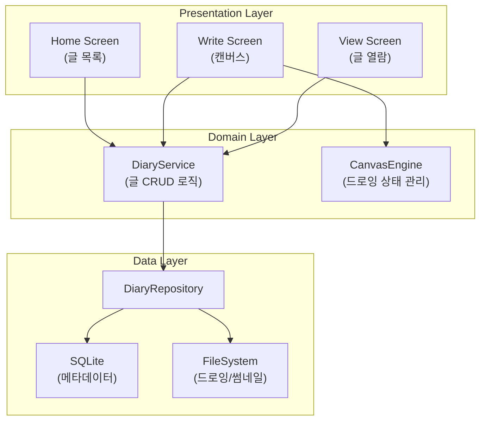
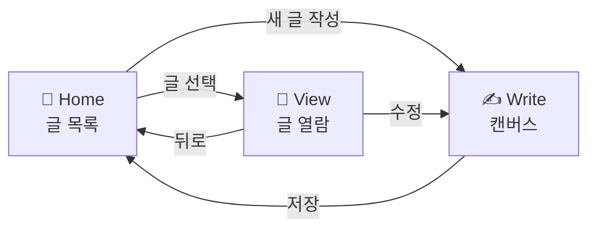
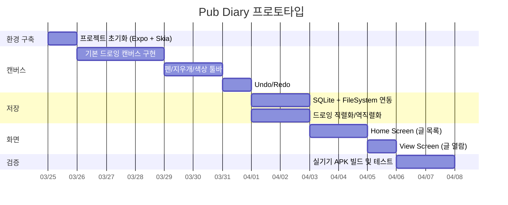

# Pub Diary - 소프트웨어 설계서

---

## 1. 프로토타입 목표

> 손글씨 글쓰기 환경과 저장 기능을 구현하여 앱의 핵심 가치를 검증한다.

### 스코프

| 포함 | 제외 (후속 단계) |
|------|------------------|
| 손글씨 작성 캔버스 | 로그인/인증 |
| 작성한 글 저장 및 목록 조회 | 커뮤니티/공유 |
| 저장된 글 열람 및 삭제 | OCR 텍스트 변환 |
| 기본 필기 도구 (펜, 지우개, 색상) | 배경 사운드 |
| 로컬 저장소 활용 | 클라우드 동기화 |

---

## 2. 기술 스택 선정

### 2.1 프레임워크: React Native + Expo

| 선택지 | 장점 | 단점 |
|--------|------|------|
| **React Native + Expo (선정)** | React/TS 경험 직접 활용, Expo로 APK 빌드 간편, 생태계 풍부 | 네이티브 캔버스 성능이 순수 네이티브 대비 약간 열세 |
| Flutter | 캔버스 성능 우수, 위젯 시스템 강력 | Dart 새로 학습 필요, 기존 스킬셋과 거리 |
| Native Android (Kotlin) | 최고의 드로잉 성능, S펜 API 직접 접근 | 웹 개발 경험 활용 불가, 개발 속도 느림 |

**선정 근거**: 프로토타입 단계에서는 빠른 구현과 검증이 우선. React/TypeScript 경험을 직접 활용할 수 있고, Expo를 통해 APK 빌드와 기기 설치가 간편함.

> **트레이드오프 노트**: 손글씨 앱에서 캔버스 성능은 핵심이다. React Native Skia가 충분한 필기 응답성을 제공하는지가 프로토타입에서 검증해야 할 가장 중요한 기술 리스크. 만약 지연이 체감된다면 네이티브 모듈로 캔버스만 교체하거나, 프레임워크 전환을 고려해야 한다.

### 2.2 드로잉 엔진: React Native Skia

```
@shopify/react-native-skia
```

- Google Skia 그래픽 엔진 기반, React Native에서 고성능 2D 렌더링 제공
- Spring Boot에서의 JPA처럼, 복잡한 네이티브 그래픽 API를 선언적으로 추상화
- Path 기반 드로잉으로 손글씨의 곡선과 필압 표현 가능
- SVG/이미지 export 지원

### 2.3 저장소: 로컬 파일시스템 + SQLite

| 데이터 | 저장 방식 | 형식 |
|--------|-----------|------|
| 글 메타데이터 (제목, 날짜, 태그) | SQLite | 구조화된 테이블 |
| 드로잉 데이터 (필기 내용) | 파일시스템 | SVG 또는 직렬화된 Path JSON |
| 썸네일 | 파일시스템 | PNG |

**선정 근거**: 프로토타입에서 외부 의존성 없이 기기 내에서 완결되는 구조. PostgreSQL에 익숙하시니 SQLite의 SQL 기반 쿼리가 자연스러울 것.

> **클라우드 옵션 (후속 단계)**: Firebase Storage 무료 티어(5GB) 또는 Supabase 무료 티어(1GB Storage + PostgreSQL)를 백업/동기화 용도로 추가 가능. Supabase는 PostgreSQL 기반이라 승원님의 기존 경험과 잘 맞음.

---

## 3. 아키텍처

### 3.1 전체 구조



### 3.2 레이어 설명

Spring의 Controller → Service → Repository 패턴과 유사한 구조:

| 레이어 | 역할 | Spring 대응 |
|--------|------|-------------|
| **Presentation** | 화면 컴포넌트, 사용자 인터랙션 | `@Controller` |
| **Domain** | 비즈니스 로직, 상태 관리 | `@Service` |
| **Data** | 저장소 접근 추상화 | `@Repository` |

### 3.3 상태 관리: Zustand

```
선정 이유: Redux 대비 보일러플레이트 최소, 프로토타입에 적합한 경량 상태 관리
```

| Store | 관리 대상 |
|-------|-----------|
| `diaryStore` | 글 목록, 현재 선택된 글, CRUD 상태 |
| `canvasStore` | 현재 드로잉 상태, 펜 설정, undo/redo 히스토리 |

---

## 4. 화면 흐름



### 4.1 Home Screen (글 목록)

- 저장된 글 목록을 카드 형태로 표시 (썸네일 + 날짜)
- 최신순 정렬
- 새 글 작성 버튼 (FAB)
- 글 삭제 (스와이프 또는 롱프레스)

### 4.2 Write Screen (캔버스)

- 전체 화면 캔버스 (Goodnotes 참고)
- 상단 또는 하단 툴바:
  - 펜 (굵기 3단계)
  - 지우개
  - 색상 선택 (5~8가지 프리셋)
  - Undo / Redo
  - 저장 버튼
- 터치/스타일러스 입력 처리
- 필압 감지 (기기 지원 시)

### 4.3 View Screen (글 열람)

- 저장된 드로잉을 원본 비율로 표시
- 핀치 줌 지원
- 수정/삭제 옵션

---

## 5. 데이터 모델

### 5.1 SQLite 스키마

```sql
CREATE TABLE diary (
    id          TEXT PRIMARY KEY,   -- UUID
    title       TEXT,               -- 사용자 입력 또는 날짜 기반 자동 생성
    created_at  INTEGER NOT NULL,   -- Unix timestamp
    updated_at  INTEGER NOT NULL,
    drawing_path TEXT NOT NULL,     -- 드로잉 파일 경로
    thumbnail_path TEXT            -- 썸네일 이미지 경로
);
```

### 5.2 드로잉 데이터 구조 (JSON)

```jsonc
{
  "version": 1,
  "canvas": {
    "width": 1080,
    "height": 1920,
    "backgroundColor": "#FFF8F0"
  },
  "strokes": [
    {
      "id": "stroke-uuid",
      "points": [
        { "x": 120.5, "y": 340.2, "pressure": 0.8, "timestamp": 1710000000 }
      ],
      "color": "#2C2C2C",
      "width": 2.5,
      "tool": "pen"
    }
  ]
}
```

> Stroke 단위로 저장하면 undo/redo가 자연스럽고, 추후 애니메이션 재생(글 쓰는 과정 재현)에도 활용 가능.

---

## 6. 디렉토리 구조

```
src/
├── app/                    # Expo Router 엔트리
│   ├── index.tsx           # Home Screen
│   ├── write.tsx           # Write Screen
│   └── view/[id].tsx       # View Screen (동적 라우트)
│
├── components/
│   ├── canvas/
│   │   ├── DrawingCanvas.tsx    # Skia 캔버스 래퍼
│   │   ├── Toolbar.tsx          # 필기 도구 툴바
│   │   └── StrokeRenderer.tsx   # Stroke → Skia Path 변환
│   ├── diary/
│   │   ├── DiaryCard.tsx        # 목록 카드 아이템
│   │   └── DiaryList.tsx        # 글 목록
│   └── ui/
│       └── ...                  # 공통 UI 컴포넌트
│
├── services/
│   ├── DiaryService.ts          # 글 CRUD 비즈니스 로직
│   └── CanvasService.ts         # 드로잉 직렬화/역직렬화
│
├── repositories/
│   └── DiaryRepository.ts       # SQLite + FileSystem 접근
│
├── stores/
│   ├── diaryStore.ts            # 글 목록 상태
│   └── canvasStore.ts           # 캔버스 상태
│
├── types/
│   └── diary.ts                 # 타입 정의
│
└── constants/
    ├── colors.ts                # 서정적 컬러 팔레트
    └── canvas.ts                # 캔버스 기본 설정값
```

---

## 7. 핵심 기술 리스크 및 검증 항목

| 리스크 | 영향도 | 검증 방법 |
|--------|--------|-----------|
| Skia 캔버스의 필기 응답성 (레이턴시) | **높음** | 실기기에서 스타일러스 필기 테스트. 16ms 이하 프레임 유지 확인 |
| 필압 감지 지원 여부 | 중간 | S펜 기기에서 pressure 값 수신 확인 |
| 드로잉 데이터 저장/로드 성능 | 중간 | 1000+ stroke 기준 저장/로드 시간 측정 |
| APK 사이즈 | 낮음 | Skia 포함 시 번들 크기 확인 (50MB 이하 목표) |

---

## 8. 의존성 목록

```json
{
  "core": {
    "expo": "~52",
    "react-native": "0.76.x",
    "typescript": "~5.3"
  },
  "drawing": {
    "@shopify/react-native-skia": "캔버스 및 드로잉 엔진"
  },
  "storage": {
    "expo-sqlite": "SQLite 메타데이터 저장",
    "expo-file-system": "드로잉/썸네일 파일 저장"
  },
  "state": {
    "zustand": "상태 관리"
  },
  "navigation": {
    "expo-router": "파일 기반 라우팅"
  }
}
```

---

## 9. 개발 로드맵 (프로토타입)



---

*프로토타입 완료 후, 사용성 테스트 결과에 따라 기술 스택 재검토 및 후속 기능(OCR, 클라우드 동기화, 커뮤니티) 설계를 진행한다.*
