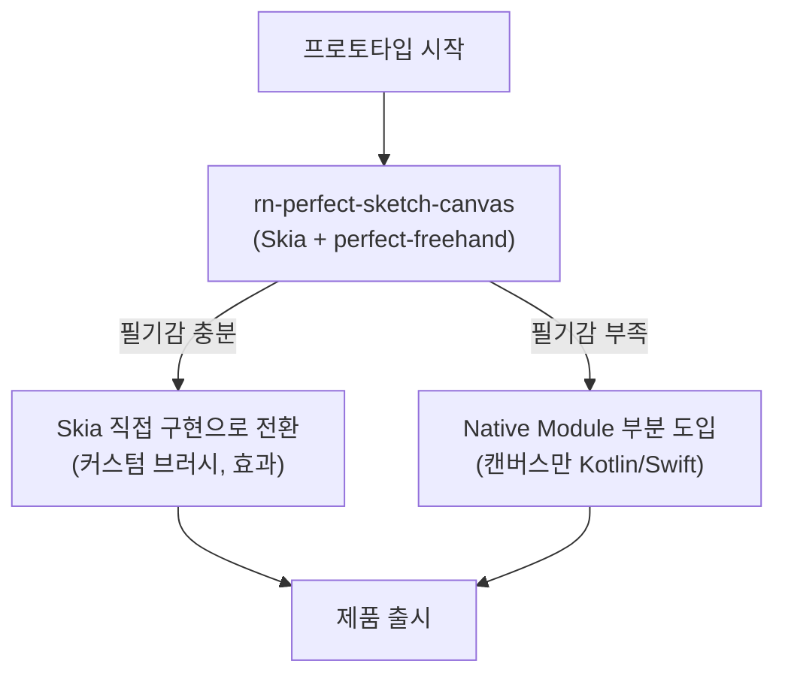

# 드로잉 엔진 대안 분석

> 손글씨 일기 앱의 핵심 기술. 필기 응답성, 필압 감지, 확장성 관점에서 비교한다.

---

## 요약 비교

| 엔진 | 성능 | 필압 감지 | Undo/Redo | Export | 유지보수 | 비고 |
|------|------|-----------|-----------|--------|----------|------|
| **@shopify/react-native-skia** | ★★★★★ | ○ (별도 통합) | ○ (상태관리 연동) | PNG, JSON | 활발 (Shopify) | **현재 선정** |
| rn-perfect-sketch-canvas | ★★★★★ | ★★★★★ | ○ | PNG, JSON | 보통 | Skia 기반 래퍼 |
| react-native-sketch-canvas | ★★★☆☆ | ★☆☆☆☆ | 내장 | PNG, JPG, JSON | 포크 다수, 원본 비활성 | 레거시 |
| react-native-draw | ★★★☆☆ | ✗ | ○ | SVG | 비활성 (3년+) | SVG 기반 |
| expo-draw | ★★☆☆☆ | ✗ | 내장 | 스크린샷, JSON | 커뮤니티 | SVG 기반 |
| react-native-signature-canvas | ★★☆☆☆ | ✗ | 기본 | 이미지 | 안정 | 서명 전용 |
| WebView + HTML Canvas | ★☆☆☆☆ | ★☆☆☆☆ | ○ | 이미지, SVG | 성숙 | **비권장** |
| Gesture Handler + SVG | ★★★★☆ | ✗ | ○ | SVG, JSON | 매우 활발 | 애니메이션에 강점 |
| Native Module (Kotlin/Swift) | ★★★★★ | ★★★★★ | 커스텀 | 자유 | 직접 유지 | 개발 비용 높음 |

---

## 상세 분석

### 1. @shopify/react-native-skia (현재 선정)

Google Skia 엔진 기반. Chrome, Android, Flutter가 사용하는 동일한 렌더링 엔진을 React Native에서 사용.

```
Spring으로 비유하면: JPA가 Hibernate를 추상화하듯,
react-native-skia는 네이티브 Skia 그래픽 API를 React 선언형으로 추상화한다.
```

**장점**
- 60 FPS 프리핸드 드로잉 달성 가능
- Path 기반 드로잉으로 곡선과 벡터 표현 우수
- Shopify가 유지보수하여 장기 안정성 기대
- PNG/이미지 export, JSON 직렬화 지원
- 웹(react-native-web)으로의 확장 가능성

**단점**
- 필압 감지가 내장되지 않음 → `perfect-freehand` 라이브러리와 조합 필요
- S펜 ToolType 감지는 커뮤니티 이슈로 논의 중 (완전 지원 아님)
- 러닝커브: Skia 드로잉 프리미티브(Path, Paint 등) 학습 필요
- React Native 0.79+, React 19+ 요구

**핵심 리스크**: Skia 자체의 드로잉 성능은 검증되었으나, React Native 브릿지를 통한 터치 이벤트 전달 레이턴시가 실제 필기감에 영향을 줄 수 있다. 프로토타입에서 반드시 실기기 테스트 필요.

---

### 2. rn-perfect-sketch-canvas (Skia + perfect-freehand)

Skia를 기반으로 `perfect-freehand` 라이브러리를 결합한 래퍼. 필압 감지와 자연스러운 필기선을 제공.

**장점**
- 필압 기반의 자연스러운 필기선 (굵기 변화)
- iOS, Android 모두 지원
- Skia 성능 그대로 활용
- 상대적으로 빠른 통합 가능

**단점**
- Skia에 대한 래퍼이므로 Skia의 제약을 그대로 상속
- 커스터마이징 깊이가 Skia 직접 사용 대비 제한적
- 커뮤니티 규모가 작아 이슈 대응 느릴 수 있음

**트레이드오프**: Skia를 직접 다루는 것 vs. 래퍼를 사용하는 것
- **래퍼 사용**: 빠르게 프로토타입 구현 가능. 하지만 커스텀 필기 효과(캘리그라피, 브러시 텍스처 등) 구현 시 래퍼의 추상화가 오히려 장벽이 될 수 있음.
- **Skia 직접 사용**: 초기 구현 비용은 높지만, 장기적으로 앱의 핵심 차별화 요소(필기감)를 세밀하게 제어 가능.

> 프로토타입에서는 rn-perfect-sketch-canvas로 빠르게 검증하고, 필기감 커스터마이징이 필요해지면 Skia 직접 구현으로 전환하는 전략도 유효하다.

---

### 3. react-native-sketch-canvas (@terrylinla)

네이티브 Android Canvas / iOS UIKit 기반의 전통적 드로잉 라이브러리.

**장점**
- Stroke 단위 Undo 내장
- JSON 직렬화로 디바이스 간 동기화 가능
- PNG/JPG export 지원

**단점**
- **투명 Path 성능 문제**: Android ~25% CPU, iOS 100% (사실상 사용 불가)
- 비투명 Path도 Android ~20%, iOS ~15% CPU
- 필압 감지 제한적
- 원본 저장소 비활성 → 여러 포크가 난립

**결론**: 레거시. 새 프로젝트에서 선택할 이유 없음.

---

### 4. WebView + HTML Canvas

React Native 안에 WebView를 띄우고 HTML Canvas API를 사용하는 방식.

```
Spring으로 비유하면: 네이티브 JDBC 대신 REST API를 통해 DB에 접근하는 것.
추상화 레이어가 하나 더 끼어 성능 오버헤드가 발생한다.
```

**장점**
- 웹 개발 경험 직접 활용 (Canvas API, PointerEvent 등)
- 풍부한 웹 라이브러리 활용 가능

**단점**
- **iOS 15 이후 WebView Canvas 렌더링 성능 심각하게 저하**
- WebView 브릿지 통신 오버헤드
- 고주파 터치 업데이트(60 FPS)에서 프레임 드랍
- 필압 이벤트가 WebView 브릿지를 통과하면서 손실/지연

**결론**: 손글씨 앱에서는 명확히 비권장. iOS에서의 성능 저하가 치명적.

---

### 5. Gesture Handler + Reanimated + SVG

react-native-gesture-handler와 react-native-reanimated를 조합하여 SVG Path를 직접 그리는 방식.

**장점**
- Software Mansion이 유지보수하는 안정적 생태계
- 120 FPS까지 달성 가능한 제스처 처리
- SVG 네이티브 export
- 다른 라이브러리(Skia 포함)와 조합 가능

**단점**
- SVG 렌더링은 복잡한 Path가 쌓일수록 성능 저하
- 필압 감지 미지원
- 드로잉 전용이 아니라 범용 제스처 라이브러리 → 드로잉 로직을 직접 구현해야 함

**트레이드오프**: Gesture Handler는 Skia와 함께 사용하면 최상의 조합이 됨. 단독으로 SVG 기반 드로잉을 구현하면 성능 천장이 낮음.

---

### 6. Native Module (Kotlin Canvas / iOS PencilKit)

플랫폼 네이티브 코드로 직접 드로잉 모듈을 작성하는 방식.

**장점**
- 최고 성능: 터치 이벤트 → 렌더링 사이 레이턴시 최소
- S펜 API, PencilKit 등 플랫폼 전용 기능 완전 접근
- 필압, 기울기, 방위각 등 모든 스타일러스 데이터 활용 가능

**단점**
- Kotlin/Swift 별도 작성 → 크로스플랫폼 이점 상실
- React Native 브릿지 설계 필요 (Turbo Module 또는 Fabric)
- 유지보수 부담 직접 감당
- 프로토타입 단계에서 과도한 투자

**트레이드오프**: 최고의 필기감을 원한다면 유일한 선택지이지만, 프로토타입 단계에서는 ROI가 맞지 않음. Skia로 시작 후 성능이 불충분할 때 캔버스 모듈만 네이티브로 교체하는 점진적 전환이 현실적.

---

## 권장 전략



1. **프로토타입**: `rn-perfect-sketch-canvas`로 빠르게 MVP 구현 → 필기 응답성 검증
2. **커스터마이징 필요 시**: Skia 직접 사용으로 전환 (래퍼 제거)
3. **성능 한계 도달 시**: 캔버스 렌더링만 Native Module로 교체

---

## 참고 오픈소스

| 프로젝트 | 설명 | 참고 포인트 |
|----------|------|-------------|
| **Saber** | 크로스플랫폼 손글씨 노트앱 (Flutter) | 아키텍처, 클라우드 동기화 |
| **Notesnook** | React Native Skia 기반 드로잉 앱 | Skia 60FPS 드로잉 구현 사례 |
| **Excalidraw** | 웹 기반 화이트보드 | 드로잉 데이터 구조, 협업 모델 |
